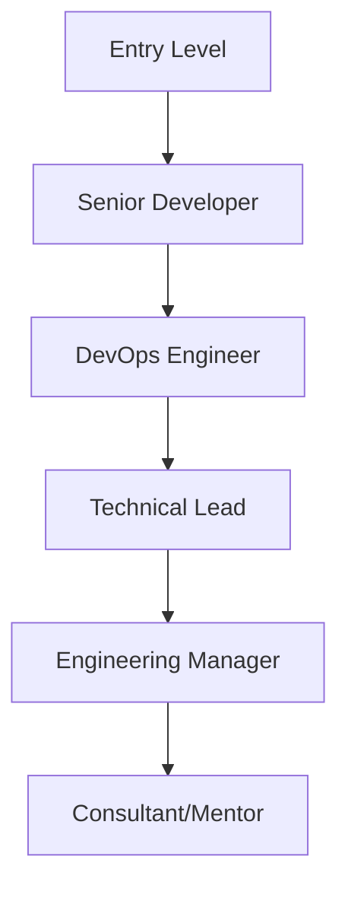

## Professional Journey

Pete Warnock has built a distinguished career spanning over 15 years in technology, focusing on cloud engineering, DevOps practices, and fullstack development.

<Columns cols={2}>
  <Card title="Early Career" icon="calendar" href="#early-career">
    Starting as a software developer and evolving into leadership roles.
  </Card>
  <Card title="Leadership Roles" icon="users" href="#leadership">
    Leading teams and driving technical strategy.
  </Card>
</Columns>

<Tabs>
  <Tab title="Technical Leadership" icon="user">
    Guiding development teams through complex projects and transformations.
  </Tab>
  <Tab title="Cloud Migration" icon="cloud">
    Successfully migrating legacy systems to modern cloud architectures.
  </Tab>
  <Tab title="DevOps Implementation" icon="settings">
    Establishing CI/CD pipelines and automation frameworks.
  </Tab>
</Tabs>

<Steps>
  <Step title="Start as Developer" icon="code">
    Began with software development fundamentals.
  </Step>
  <Step title="Move to DevOps" icon="terminal">
    Transitioned into infrastructure and automation.
  </Step>
  <Step title="Lead Teams" icon="users">
    Took on leadership roles in tech organizations.
  </Step>
  <Step title="Consult and Mentor" icon="book-open">
    Now shares knowledge through consulting and mentoring.
  </Step>
</Steps>

<ExpandableGroup>
  <Expandable title="Key Achievements" default-open="true">
    - Led migration of enterprise applications to cloud
    - Implemented automated testing and deployment pipelines
    - Mentored junior developers and established best practices
  </Expandable>
  <Expandable title="Industry Impact" default-open="false">
    Contributed to open-source projects and spoke at tech conferences.
  </Expandable>
</ExpandableGroup>

<Callout kind="tip">Pete's experience combines technical depth with strategic vision, making him valuable for both implementation and leadership.</Callout>

