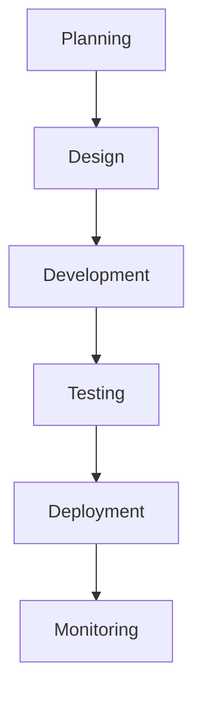

## Featured Work

Pete Warnock has contributed to numerous projects demonstrating his expertise in cloud engineering, DevOps, and fullstack development.

<Columns cols={2}>
  <Card title="Cloud Migration Project" icon="cloud" href="#cloud-migration">
    Large-scale application migration to AWS.
  </Card>
  <Card title="DevOps Pipeline" icon="settings" href="#devops-pipeline">
    Automated CI/CD implementation.
  </Card>
</Columns>

<Tabs>
  <Tab title="Enterprise Solutions" icon="building">
    Developed scalable enterprise applications using microservices architecture.
  </Tab>
  <Tab title="Open Source" icon="github">
    Contributed to various open-source projects and tools.
  </Tab>
  <Tab title="Consulting Work" icon="users">
    Provided technical consulting for startups and established companies.
  </Tab>
</Tabs>

<Steps>
  <Step title="Planning" icon="target">
    Define project scope and requirements.
  </Step>
  <Step title="Development" icon="code">
    Implement solutions using best practices.
  </Step>
  <Step title="Testing" icon="check-circle">
    Ensure quality through comprehensive testing.
  </Step>
  <Step title="Deployment" icon="rocket">
    Deploy to production with monitoring.
  </Step>
</Steps>

<ExpandableGroup>
  <Expandable title="Case Study: Cloud Migration" default-open="true">
    Successfully migrated a legacy monolithic application to a cloud-native microservices architecture, reducing costs by 40% and improving scalability.
  </Expandable>
  <Expandable title="Open Source Contributions" default-open="false">
    Maintained libraries for infrastructure automation and contributed to Kubernetes ecosystem projects.
  </Expandable>
</ExpandableGroup>

<Callout kind="info">All projects emphasize reliability, scalability, and maintainability.</Callout>

